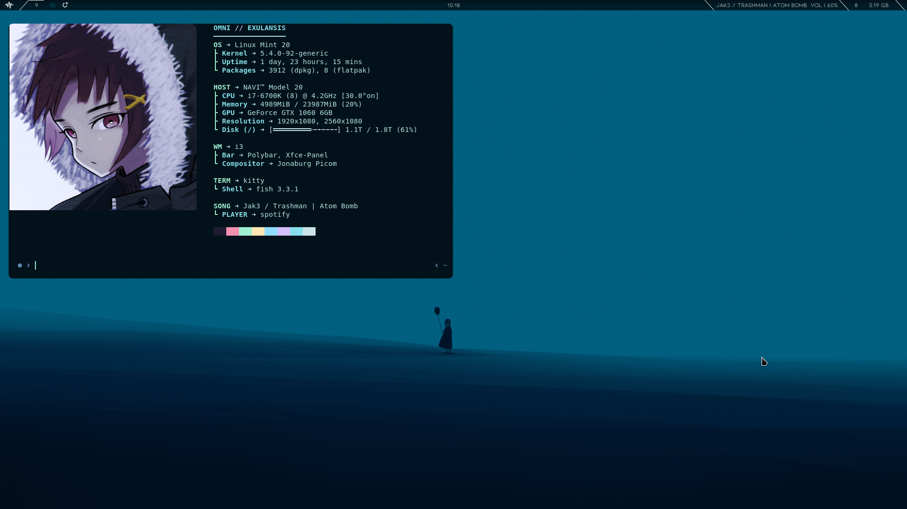
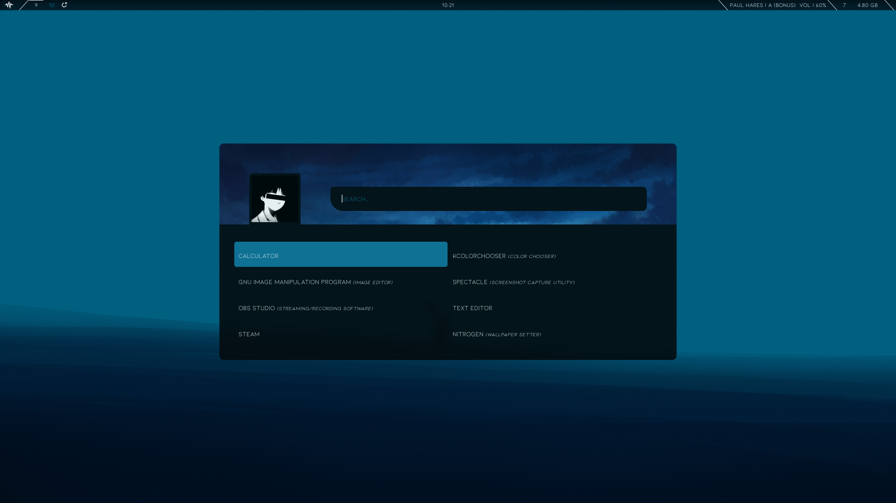

# dotfiles
### Dotfiles for my i3wm + xfce4 setup.
#### I plan on cleaning this up, but here are most of my dots
 

## My setup
I use i3wm on top of xfce4, there's plenty of tutorials on how to do this online, but they're old so you may need to do some tweaking.
- Terminal   | [Kitty](https://sw.kovidgoyal.net/kitty/)
- Bar        | [Polybar](https://github.com/polybar/polybar)
- Compositor | [Tryone Compton](https://github.com/tryone144/compton)
- Launcher   | [Rofi](https://github.com/davatorium/rofi)
 

## Screenshots

### My polybar uses some scripts.
Spotify Currently Playing | [Polybar Spotify](https://github.com/Jvanrhijn/polybar-spotify), dependencies are python2 or 3, and the python dbus module
Everything else are bash scripts I wrote which also have some dependecies to work:   
`  xwininfo, xprop`

I also use a rofi powermenu that I got from [here](https://github.com/adi1090x/rofi)
I stole the neofetch in the first screenshot from [here](https://gist.github.com/Talljoe/929e205a08c1add22e7b325e35cac74d)

# Using
### Start by cloning the repo
`git clone https://github.com/Shizzledoink/dotfiles.git`
### Install Fonts by moving or copying them to ~/.local/share/fonts:
`cp dotfiles/fonts/* ~/.local/share/fonts/`
### Move scripts to your home directory
`cp -r dotfiles/{.i3nw/,.prodscripts/} ~/`
### Move or copy everything in .config to your .config folder
#### (Note that this overwrites your current configs so you may want to do a backup)
`cp -r dotfiles/.config/* ~/.config/`
### Thats it! Easiest way to refresh everything is to just log out and in.
